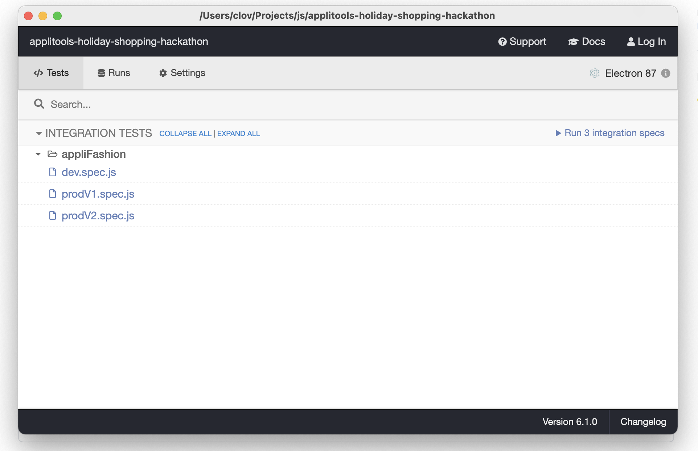

# Applitools Holiday Shopping Hackathon

### Pre-requisite

1. Install [Node.js](https://nodejs.org/en/download/)

#### Run

1. Download the app
   - Option 1: `git clone https://github.com/clovisphere/applitools-holiday-shopping-hackathon.git`
   - Option 2: Download it as a Zip file and extract it
2. CD into the `applitools-holiday-shopping-hackathon` folder
3. Set up environment variable APPLITOOLS_API_KEY with your own API key.
   - Login to Applitools > Click on the Person icon > Select My API Key
   - Linux/Mac: `export APPLITOOLS_API_KEY=<your_key>`
   - Windows: `set APPLITOOLS_API_KEY=<your_key>`
4. run `yarn` or `npm install`
5. run `npx eyes-setup`
6. run `npx cypress open` (this will open the cypress GUI)

:point_up:To start a test, just click on it:-) Also start with: V1 > Dev > V2 :smiley:
